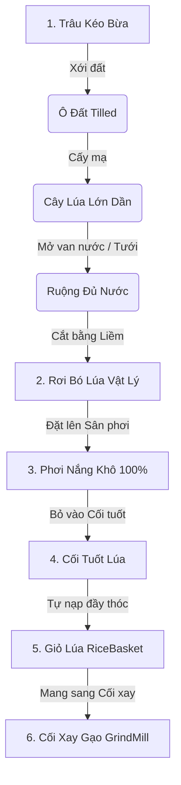

# 🌾 Hướng Dẫn Sử Dụng Hệ Thống Nông Nghiệp (Khoa Farming System)
> **Dành cho:** Các thành viên trong nhóm phát triển dự án *AR_Grind_mill (VR)*  
> **Vị trí tài nguyên:** `Assets/Khoa/`  
> **Namespace:** `Khoa.Farming`

---

## 📖 Mục Lục
1. [Cách Lấy Code Mới Nhất](#1-cách-lấy-code-mới-nhất)
2. [Các Prefab Có Sẵn & Cách Đặt Vào Scene](#2-các-prefab-có-sẵn--cách-đặt-vào-scene)
3. [Chuỗi Gameplay Hoàn Chỉnh (Game Loop)](#3-chuỗi-gameplay-hoàn-chỉnh-game-loop)
4. [Công Cụ Menu 1-Click Trong Unity Editor](#4-công-cụ-menu-1-click-trong-unity-editor)
5. [Tích Hợp API & Events (Dành Cho Quest, UI, Audio)](#5-tích-hợp-api--events-dành-cho-quest-ui-audio)
6. [Lưu Ý Kỹ Thuật & Tương Thích](#6-lưu-ý-kỹ-thuật--tương-thích)

---

## 1. 📥 Cách Lấy Code Mới Nhất

Hệ thống Farming nằm hoàn toàn trong thư mục `Assets/Khoa/`, có `Assembly Definition` riêng và độc lập 100%, **không sửa bất kỳ file nào trong `Assets/MyFolder/` hay `Assets/Scripts/`** nên bạn có thể pull thoải mái mà không sợ conflict:

```bash
git checkout VR
git pull origin VR
```

---

## 2. 🏗️ Các Prefab Có Sẵn & Cách Đặt Vào Scene

Tất cả Prefab đã được cấu hình đầy đủ Vật lý (Physics), Tương tác VR (XR Interaction Toolkit) và Vật liệu PBR trong thư mục `Assets/Khoa/Prefabs/`:

| Tên Prefab | Chức Năng | Vị Trí Nên Đặt Trên Map |
| :--- | :--- | :--- |
| **`Plot_Prefab`** | Ô đất ruộng (tự đổi màu đất ẩm/khô, có váng nước nổi) | Khu vực đồng ruộng |
| **`Sluice_Gate_Prefab`** | Van nước kênh mương (gạt cần van để xả nước vào ruộng) | Đầu mương nước dẫn vào ruộng |
| **`Rice_Drying_Yard_Prefab`** | Sân phơi lúa gạch (tăng độ khô khi nắng, cảnh báo khi mưa) | Sân trước nhà chính |
| **`Rice_Thresher_Prefab`** | Cối tuốt lúa (tách hạt thóc từ bó lúa khô, tự nạp vào giỏ) | Cạnh sân phơi hoặc gần Cối xay |
| **`Rice_Bundle_Prefab`** | Bó lúa vật lý sau khi gặt (cầm nắm bằng tay VR, mang vác) | Tự sinh khi gặt (hoặc đặt test) |
| **`Rice_Prefab`** | Cây lúa mẫu 5 giai đoạn phát triển | Tự sinh khi cấy mạ |

---

## 3. 🎮 Chuỗi Gameplay Hoàn Chỉnh (Game Loop)



### Chi tiết từng bước:
1. **Xới đất**: Cưỡi trâu đi qua ô đất `Plot_Prefab` (hoặc dùng cuốc) để đất chuyển sang trạng thái xới tơi.
2. **Cấy mạ & Tưới nước**: Cầm mạ cấy vào ô đất -> Cây lúa mọc lên. Gạt cần van nước `Sluice_Gate_Prefab` để cấp nước cho ruộng.
3. **Gặt lúa**: Khi lúa chín vàng, dùng Liềm chém vào gốc lúa -> Rơi ra **Bó Lúa (`Rice_Bundle_Prefab`)**.
4. **Phơi lúa**: Cầm bó lúa đặt lên **Sân Phơi (`Rice_Drying_Yard_Prefab`)**. Khi phơi đủ nắng (100%), bó lúa sẽ chuyển sang trạng thái khô giòn.
   * *Nếu trời mưa*: Sân phơi sẽ ngừng phơi và cảnh báo. Mang bó lúa vào hiên nhà/kho để bảo quản.
5. **Tuốt lúa**: Cầm bó lúa khô thả vào **Cối Tuốt (`Rice_Thresher_Prefab`)**.
6. **Nhận thóc vào Giỏ**:
   * Nếu đặt một chiếc `RiceBasket` (Giỏ lúa) cạnh cối tuốt -> Cối sẽ **tự động đổ đầy thóc vàng vào giỏ**.
   * Hoặc nếu người chơi đang chọn Giỏ lúa trong túi đồ (`Inventory`) -> **Giỏ trong túi đồ sẽ tự động đầy thóc**.
7. **Xay gạo**: Cầm giỏ lúa đầy mang sang Cối xay gạo (`GrindMill`) để thực hiện công đoạn xay xát gạo như bình thường!

---

## 4. 🛠️ Công Cụ Menu 1-Click Trong Unity Editor

Trên thanh menu Unity, vào mục **`Khoa`**:

1. **`Khoa/Tạo Bộ Công Cụ Nông Nghiệp (Test)`**:
   * Tự động sinh ra 1 bộ đồ nghề VR hoàn chỉnh ngay trước mặt Camera: **Cuốc xới đất, Bó mạ, Bao phân bón, Bình tưới nước, Liềm gặt lúa** (tất cả đều cầm nắm được bằng tay VR).
2. **`Khoa/Farming/Setup Farming Prefabs`**:
   * Bấm nút **"Gắn Lưỡi Bừa Tự Động Vào Trâu Trong Scene"**: Tự động tìm con trâu và gắn lưỡi bừa sau đuôi trâu.
3. **`Khoa/Farming/Generate Plot Grid`**:
   * Tạo nhanh một lưới ruộng n x m ô, tự động bắt dính theo cao độ Terrain.

---

## 5. 💻 Tích Hợp API & Events (Dành Cho Quest, UI, Audio)

Các bạn làm Quest, UI hoặc Audio chỉ cần `using Khoa.Farming;` để lắng nghe các sự kiện:

### Bắt sự kiện khi gặt lúa hoặc tuốt lúa:
```csharp
using Khoa.Farming;
using UnityEngine;

public class QuestManagerExample : MonoBehaviour
{
    public RiceThresher thresher;
    public CropPlot cropPlot;

    void OnEnable()
    {
        // Khi gặt được 1 bó lúa
        if (cropPlot != null)
            cropPlot.OnCropHarvested += OnHarvestRice;

        // Khi tuốt lúa ra hạt thóc
        if (thresher != null)
            thresher.OnRiceThreshed += OnThreshGrains;
    }

    private void OnHarvestRice(RicePlant plant)
    {
        Debug.Log("Quest: Đã gặt lúa thành công!");
    }

    private void OnThreshGrains(int grainAmount)
    {
        Debug.Log($"Quest: Đã tuốt được {grainAmount} hạt thóc!");
    }
}
```

### Bắt sự kiện thay đổi thời tiết (Nắng/Mưa):
```csharp
using Khoa.Farming;

void Start()
{
    if (FarmingWeatherSystem.Instance != null)
    {
        FarmingWeatherSystem.Instance.OnWeatherChanged += (weather) =>
        {
            if (weather == WeatherType.Rainy)
            {
                Debug.Log("Trời mưa: Bật hiệu ứng mưa và đổi nhạc nền rả rích!");
            }
            else if (weather == WeatherType.Sunny)
            {
                Debug.Log("Trời nắng: Bật tiếng chim hót và nhạc miền Tây rộn ràng!");
            }
        };
    }
}
```

---

## 6. ⚠️ Lưu Ý Kỹ Thuật & Tương Thích

* **Assembly Definition**: Toàn bộ script của hệ thống nằm trong `Khoa.Farming.asmdef`.
* **Kết nối với `RiceBasketController` & `InventoryController`**: Được thực hiện qua cơ chế Component Reflection an toàn. Các bạn thoải mái sửa đổi, mở rộng file trong `Assets/MyFolder/` mà không lo bị gãy biên dịch (Compile Error).
* **Kiểm thử tự động**: Có sẵn 14 EditMode Unit Tests trong `Assets/Khoa/Tests/EditMode/`. Chạy qua Unity Test Runner bất kỳ lúc nào để xác nhận tính ổn định.
