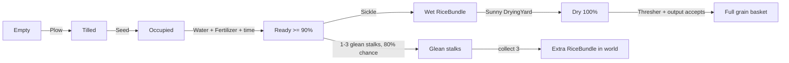

# Khoa Farming — đặc tả logic đã kiểm chứng

Tài liệu này mô tả hành vi hiện có trong code ngày 2026-08-21. Nếu tài liệu và test
mâu thuẫn, test regression cùng code runtime là nguồn sự thật cần ưu tiên.

## 1. Vòng lặp chính



## 2. Plot và nông cụ

`CropPlot` có ba trạng thái:

| Trạng thái | Tác động hợp lệ | Kết quả |
|---|---|---|
| `Empty` | `Plow` | `Tilled` |
| `Tilled` | `Seed` | tạo cây, thành `Occupied` |
| `Occupied` | `Fertilizer` | gọi `RicePlant.Fertilize()` |
| `Occupied` | `Water` | tăng nước cây và moisture plot |
| `Occupied` | `Sickle`, cây đã chín | gặt và trở về `Empty` |

Generic select không được dùng làm đường tắt gameplay. `allowDebugSelectInteractions`
mặc định `false`; `Awake()` vô hiệu hóa `XRSimpleInteractable` của plot. Chỉ bật cờ
này trong scene test/debug có chủ đích.

`currentMoisture` luôn được clamp 0..1. Màu đất được cập nhật bằng
`MaterialPropertyBlock`. Water surface hiện khi:

- plot `Occupied`: moisture >= 0.35;
- plot `Empty` hoặc `Tilled`: moisture >= 0.70.

## 3. Sinh trưởng cây lúa

`Rice_Data.asset` hiện cấu hình thời gian chín 180 giây, max water 100, mất 1 đơn
vị nước/giây, cần ít nhất 20 nước để tiếp tục lớn, chịu cạn hoàn toàn 30 giây và hệ
số phân bón 1.5x.

| Growth progress | Crop state |
|---:|---|
| 0 đến dưới 25 | `Seedling` |
| 25 đến dưới 60 | `Growing` |
| 60 đến dưới 90 | `Maturing` |
| 90 đến 100 | `ReadyToHarvest` |
| cạn nước quá thời gian cấu hình | `Dead` |

Growth chỉ tăng khi `currentWater >= minWaterToGrow`. Cây `Dead` không hồi sinh khi
tưới và cây `ReadyToHarvest` ngừng update growth/water.

## 4. Cống tưới

Khi `isOpen`, mỗi frame cống gọi `WaterPlot(waterFlowRate * deltaTime)` cho từng
plot không-null trong `connectedPlots`.

- Scene chính gán trực tiếp đúng 10.000 plot và tắt auto-find để kết quả ổn định.
- Scene phụ có thể để danh sách rỗng và bật `autoFindNearbyPlotsOnStart`; `Start()`
  sẽ quét collider trong `autoFindRadius` (mặc định 25 m).
- XR Select gọi `ToggleGate()`. Lever chỉ phản ánh hai góc đóng/mở, không phải mô
  phỏng joint liên tục.

## 5. Gặt và mót

Gặt hợp lệ sinh `RiceBundleItem`, sau đó có xác suất 0.8 sinh ngẫu nhiên 1..3
`GleanedRiceStalk`. Plot trở về `Empty`.

Mỗi stalk được collect làm tăng `GleanedRiceStalk.currentGleanedCount`. Đủ 3:

1. trừ/reset tiến độ;
2. instantiate bundle ở vị trí world gần stalk cuối;
3. gán lượng thóc cấu hình;
4. phát event bundle crafted.

Bundle không tự attach vào XR hand. Counter static được reset qua
`RuntimeInitializeOnLoadMethod(SubsystemRegistration)` khi bắt đầu play session mới.

## 6. Phơi, mưa và mái che

`RiceDryingYard` quản lý bundle đi vào/ra trigger.

- Nắng: tăng dryness 5%/giây tới 100; tại 100 thì `isDry = true`.
- Mưa và không sheltered: giảm dryness 8%/giây; dưới 100 thì `isDry = false`.
- Overcast: không tăng độ khô.
- `RiceShelterZone` đặt `isSheltered` khi bundle nằm trong trigger mái che.

Scene chính tạo một `FarmingWeatherSystem` auto-cycle mỗi 120 giây và một shelter
zone theo bounds của `StiltHouse`.

## 7. Transaction máy tuốt

Điều kiện đầu vào: bundle khác null và `isDry == true`.

```text
grains = round(bundle.grainAmount * grainYieldMultiplier)
receiver.TryReceiveGrain(grains)
    false -> giữ bundle, không FX/event/straw, trả false
    true  -> phát FX/audio/event, tạo straw nếu có, hủy bundle, trả true
```

Receiver ưu tiên `RiceBasketController` rỗng trong bán kính 2.5 m; nếu không có và
`autoFillInventoryBasket` bật, receiver thử giỏ trong inventory. Kết nối này dùng
reflection. Thành công được xác nhận bằng việc gọi được `SetFull(true)`, không chỉ
bằng việc đã tính ra số hạt.

Quy tắc transaction ngăn mất bó lúa khi scene thiếu giỏ, inventory chưa sẵn sàng
hoặc API phía team thay đổi.

## 8. Scene invariants

`FarmingSceneIntegrator` và regression test cùng bảo vệ các invariant sau:

- đúng 10.000 plot; setup chuẩn là 100 x 100;
- đúng một cống, sân phơi, máy tuốt, weather system, shelter, plow attachment và
  physical rice basket;
- cống nối đủ mọi plot;
- prefab máy tuốt không có missing MonoBehaviour;
- plot nằm sát dưới `FieldWaterPlane`, không nằm sâu dưới mặt nước.

## 9. Bằng chứng test

EditMode 27 test bao phủ FSM, nước, tăng trưởng, phơi/mưa/mái che, tuốt, receiver,
mót lúa, particle factory, prefab và serialized scene invariants.

PlayMode 2 test bao phủ:

- `SluiceGate.Start()` tự tìm plot và tưới qua nhiều frame;
- `RiceDryingYard` nhận physical bundle qua trigger và làm khô theo thời gian.

Mốc chạy Unity CLI ngày 2026-08-21: 27/27 EditMode và 2/2 PlayMode passed. Vẫn cần
QA thủ công trên kính VR cho ergonomics, collider thực tế và cảm giác tương tác.
