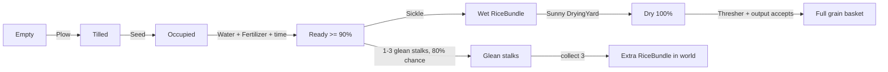

# Khoa Farming — đặc tả logic đã kiểm chứng

Tài liệu này mô tả hành vi hiện có trong code ngày 2026-08-25. Nếu tài liệu và test
mâu thuẫn, test regression cùng code runtime là nguồn sự thật cần ưu tiên.

## 1. Vòng lặp chính



## 2. Plot và nông cụ

`CropPlot` có ba trạng thái:

| Trạng thái | Tác động hợp lệ | Kết quả |
|---|---|---|
| `Empty` | `Plow` | `Tilled` |
| `Tilled` | `Seed` | tạo cây, thành `Occupied` |
| `Occupied` | `Fertilizer` | gọi `RicePlant.Fertilize()` |
| `Occupied` | `Water` | tăng nước cây và moisture plot |
| `Occupied` | `Sickle`, cây đã chín | gặt và trở về `Empty` |

Generic select không được dùng làm đường tắt gameplay. `allowDebugSelectInteractions`
mặc định `false`; `Awake()` vô hiệu hóa `XRSimpleInteractable` của plot. Chỉ bật cờ
này trong scene test/debug có chủ đích.

`currentMoisture` luôn được clamp 0..1. Màu đất được cập nhật bằng
`MaterialPropertyBlock`. Water surface hiện khi:

- plot `Occupied`: moisture >= 0.35;
- plot `Empty` hoặc `Tilled`: moisture >= 0.70.

## 3. Sinh trưởng cây lúa

`Rice_Data.asset` hiện cấu hình thời gian chín 180 giây, max water 100, mất 1 đơn
vị nước/giây, cần ít nhất 20 nước để tiếp tục lớn, chịu cạn hoàn toàn 30 giây và hệ
số phân bón 1.5x.

| Growth progress | Crop state |
|---:|---|
| 0 đến dưới 25 | `Seedling` |
| 25 đến dưới 60 | `Growing` |
| 60 đến dưới 90 | `Maturing` |
| 90 đến 100 | `ReadyToHarvest` |
| cạn nước quá thời gian cấu hình | `Dead` |

Growth chỉ tăng khi `currentWater >= minWaterToGrow`. Cây `Dead` không hồi sinh khi
tưới và cây `ReadyToHarvest` ngừng update growth/water.

## 4. Cống tưới

Khi `isOpen`, cống cộng dồn `deltaTime` và chỉ duyệt `connectedPlots` khi đủ
`irrigationTickInterval` (mặc định 0,1 giây). Lượng nước mỗi tick là
`waterFlowRate * openAmount * thời_gian_đã_cộng_dồn`, nên tốc độ nước thay đổi liên
tục theo góc cần nhưng grid lớn không bị cập nhật theo từng rendered frame.

- Scene chính gán trực tiếp mọi plot của grid do designer chọn và tắt auto-find để
  kết quả ổn định. Chạy integration lại sau khi generate grid mới để refresh wiring.
- Scene phụ có thể để danh sách rỗng và bật `autoFindNearbyPlotsOnStart`; `Start()`
  sẽ quét collider trong `autoFindRadius` (mặc định 25 m).
- `SluiceGateLever` lấy vị trí attach của tay XR trong mặt phẳng YZ của pivot, đổi
  thành góc quanh trục X rồi map cung 90° -> 45° thành `openAmount` 0 -> 1.
- `XRGrabInteractable` của handle tắt track position, rotation, scale và throw;
  kinematic Rigidbody vẫn cho XRI/physics nhận tương tác nhưng không làm rời cần.
- Thả trong 8% gần đầu cung sẽ snap về 0 hoặc 1. Ở giữa cung, mức mở được giữ nguyên.
- XR Select trên collider khung gọi `ToggleGate()` làm fallback và vẫn giữ API cũ
  `OpenGate()`, `CloseGate()`, `ToggleGate()`, `OnGateStateChanged(bool)`.
- Đóng van reset phần thời gian tick đang cộng dồn, tránh một đợt tưới cũ bị phát
  ngay khi mở lại.

## 5. Gặt và mót

Gặt hợp lệ sinh `RiceBundleItem`, sau đó có xác suất 0.8 sinh ngẫu nhiên 1..3
`GleanedRiceStalk`. Plot trở về `Empty`.

Mỗi stalk được collect làm tăng `GleanedRiceStalk.currentGleanedCount`. Đủ 3:

1. trừ/reset tiến độ;
2. instantiate bundle ở vị trí world gần stalk cuối;
3. gán lượng thóc cấu hình;
4. phát event bundle crafted.

Bundle không tự attach vào XR hand. Counter static được reset qua
`RuntimeInitializeOnLoadMethod(SubsystemRegistration)` khi bắt đầu play session mới.

## 6. Phơi, mưa và mái che

`RiceDryingYard` quản lý bundle đi vào/ra trigger.

- Nắng: tăng dryness 5%/giây tới 100; tại 100 thì `isDry = true`.
- Mưa và không sheltered: giảm dryness 8%/giây; dưới 100 thì `isDry = false`.
- Overcast: không tăng độ khô.
- `RiceShelterZone` đặt `isSheltered` khi bundle nằm trong trigger mái che.

Scene chính tạo một `FarmingWeatherSystem` auto-cycle mỗi 120 giây và một shelter
zone theo bounds của `StiltHouse`.

## 7. Transaction máy tuốt

Điều kiện đầu vào: bundle khác null và `isDry == true`.

```text
grains = round(bundle.grainAmount * grainYieldMultiplier)
receiver.TryReceiveGrain(grains)
    false -> giữ bundle, không FX/event/straw, trả false
    true  -> phát FX/audio/event, tạo straw nếu có, hủy bundle, trả true
```

Receiver ưu tiên `RiceBasketController` rỗng trong bán kính 2.5 m; nếu không có và
`autoFillInventoryBasket` bật, receiver thử giỏ trong inventory. Kết nối này dùng
reflection. Thành công được xác nhận bằng việc gọi được `SetFull(true)`, không chỉ
bằng việc đã tính ra số hạt.

Quy tắc transaction ngăn mất bó lúa khi scene thiếu giỏ, inventory chưa sẵn sàng
hoặc API phía team thay đổi.

## 8. Terrain placement và scene invariants

`PlotGridGenerator` xác định Terrain tại tâm mỗi cell, sau đó
`TerrainPlotPlacement`:

1. lấy mẫu footprint theo lưới 3 x 3 mặc định;
2. lấy trung bình normal để tính rotation phù hợp địa hình;
3. lấy lại đúng các điểm trên mặt đáy plot sau khi xoay;
4. tính center Y tối thiểu sao cho mọi điểm đáy cao hơn Terrain ít nhất `Y Offset`.

Nếu footprint vượt ranh giới một Terrain tile, từng điểm mẫu tự chọn tile lân cận
chứa tọa độ đó. Plot không bị bỏ chỉ vì các góc nằm trên hai tile khác nhau.

Cách này xử lý cả độ dốc và phần terrain lồi dưới góc plot. `Max Terrain Height`
vẫn chỉ là bộ lọc cell; nó không quyết định placement Y.

`FarmingSceneIntegrator` và regression test cùng bảo vệ các invariant sau:

- giữ nguyên số lượng plot và transform của grid do designer tạo;
- grid generator và scene production đều là 100 x 100, spacing 0,08 m, sampling
  5 x 5; scene có đúng 10.000 plot và 100 tọa độ X × 100 tọa độ Z;
- đúng một cống, sân phơi, máy tuốt, weather system, shelter, plow attachment và
  physical rice basket;
- cống nối đủ mọi plot;
- input Left Select, Right Select và Left Move của `BuffaloRider` đều khác null;
- plow trigger có kinematic Rigidbody để Unity phát `OnTriggerEnter`;
- station đặt đáy collider theo Terrain; object nước inactive vẫn được tìm thấy khi
  cần fallback cao độ;
- giỏ output của Khoa là instance riêng, không reparent giỏ do hệ thống khác sở hữu;
- `SpawnPoint` của plot nằm trên mặt trên collider;
- prefab máy tuốt không có missing MonoBehaviour;
- các điểm mẫu ở đáy plot không xuyên Terrain.

Khi scene chính đã mở, integration dùng lại đúng scene instance đang dirty để giữ
grid vừa generate. Nếu đang đứng ở scene khác có thay đổi chưa lưu, interactive mode
hỏi lưu trước; batch mode dừng an toàn.

## 9. Vegetation cảnh quan

Vegetation trang trí dùng Unity Terrain `TreeInstance`, độc lập với FSM `RicePlant`.
Generator tuân theo pipeline:

1. nhận diện nhóm prototype bằng tên prefab, loại `RicePlant` và `Vegetable`;
2. sinh candidate Poisson-disc deterministic trên từng Terrain;
3. bỏ điểm chìm dưới water plane, dốc quá 32 độ, nằm trong công trình hoặc texture
   đường có weight từ 0,72;
4. phân loại `VillageGarden`, `Waterside`, `FieldEdge`, `OpenCountryside` bằng khoảng
   cách tới bounds scene thật;
5. áp mật độ và bảng tỷ lệ loài riêng theo zone; patch hash 55 m tạo cụm cây nhưng
   vẫn trộn sample uniform để không một loài phủ toàn map;
6. áp khoảng cách tán 4,8..11 m tùy loài bằng spatial hash dùng chung qua seam giữa
   bốn Terrain;
7. đo bounds renderer của prefab trong preview scene và đổi về kích thước mục tiêu
   theo mét trước khi tạo `TreeInstance`.

Các invariant:

- cùng scene + seed tạo cùng plan;
- preview không sửa `TerrainData` và không save scene;
- apply thay cây trang trí nhưng không sinh Rice/Vegetable;
- vùng cấm không gộp các công trình xa nhau thành một root AABB khổng lồ;
- `ApplyBatch` chỉ lưu scene chính và TerrainData sau khi plan tạo thành công;
- cây cao/tán lớn phải giữ khoảng cách lớn hơn chuối và chanh.

## 10. Bằng chứng test

PlayMode 5 test bao phủ:

- `SluiceGate.Start()` tự tìm plot và tưới theo tick;
- batching không ghi lại toàn grid mỗi rendered frame;
- mức mở 25% tạo đúng 25% lượng tưới thực tế so với mở hoàn toàn;
- `RiceDryingYard` nhận physical bundle qua trigger và làm khô theo thời gian.
- `BuffaloPlowAttachment` xới plot qua đường physics trigger thật.

Mốc chạy Unity CLI ngày 2026-08-25: 4/4 EditMode lever/grid, 1/1 validation scene
production và 5/5 PlayMode passed. Full EditMode suite không chạy lại theo chủ đích
giảm tải; mốc full gần nhất là 38/38 ngày 2026-08-24. Vẫn cần QA thủ công trên kính
VR cho ergonomics và cảm giác kéo cần.

Vegetation có 10 EditMode test mục tiêu cho determinism, Poisson minimum distance,
zone priority, species profile, variable canopy spacing, density, prototype mapping,
kích thước mục tiêu, preview không ghi asset và giới hạn diversity. Inspector sau
apply xác nhận đúng 20.999 instance, dùng 50 prototype và không có Rice/Vegetable.
