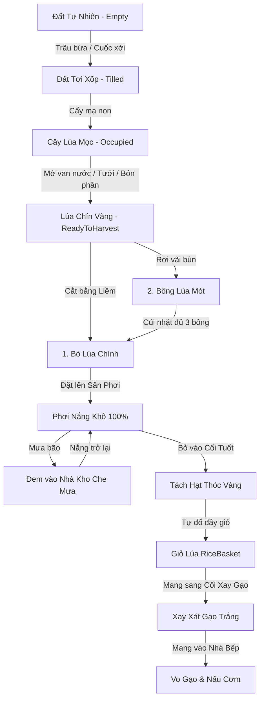
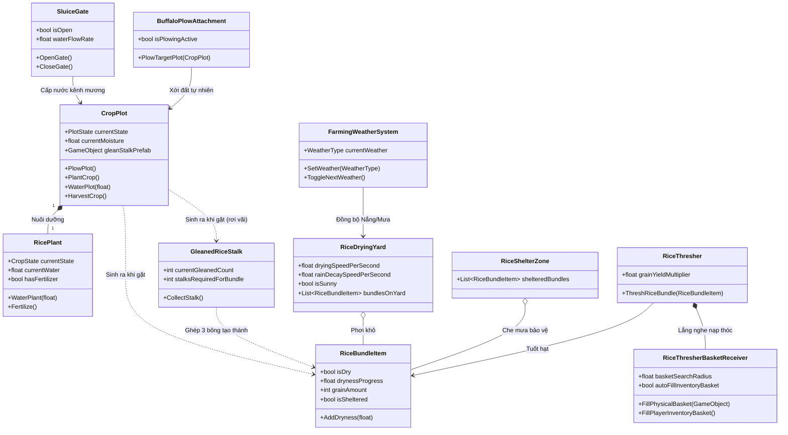

# 🧠 BẢNG ĐẶC TẢ TOÀN DIỆN LOGIC GAME & KIẾN TRÚC NÔNG NGHIỆP (KHOA FARMING SYSTEM)
> **Tài liệu đặc tả logic nội bộ**  
> **Dự án:** AR_Grind_mill (VR Farming Experience)  
> **Tác giả:** Khoa (Chris-KH)  
> **Namespace:** `Khoa.Farming` | **Assembly:** `Khoa.Farming.asmdef`  
> **Cập nhật:** Unity 6 LTS / Modern Unity XR Standards  

---

## 📑 MỤC LỤC
1. [Tổng Quan Kiến Trúc & Vòng Lặp Gameplay (Core Game Loop)](#1-tổng-quan-kiến-trúc--vòng-lặp-gameplay-core-game-loop)
2. [Chi Tiết Logic Từng Phân Hệ (Module Deep Dive)](#2-chi-tiết-logic-từng-phân-hệ-module-deep-dive)
   - [2.1. Phân Hệ Đất Ruộng Động (CropPlot)](#21-phân-hệ-đất-ruộng-động-cropplot)
   - [2.2. Phân Hệ Sinh Trưởng Cây Lúa (RicePlant & CropData)](#22-phân-hệ-sinh-trưởng-cây-lúa-riceplant--cropdata)
   - [2.3. Phân Hệ Thủy Lợi & Tưới Tiêu (SluiceGate)](#23-phân-hệ-thủy-lợi--tưới-tiêu-sluicegate)
   - [2.4. Phân Hệ Cơ Giới Hóa Trâu Bừa (BuffaloPlowAttachment)](#24-phân-hệ-cơ-giới-hóa-trâu-bừa-buffaloplowattachment)
   - [2.5. Phân Hệ Thu Hoạch & Mót Lúa (RiceBundleItem & GleanedRiceStalk)](#25-phân-hệ-thu-hoạch--mót-lúa-ricebundleitem--gleanedricestalk)
   - [2.6. Phân Hệ Phơi Lúa, Thời Tiết & Nhà Kho (DryingYard, WeatherSystem, ShelterZone)](#26-phân-hệ-phơi-lúa-thời-tiết--nhà-kho-dryingyard-weathersystem-shelterzone)
   - [2.7. Phân Hệ Tuốt Lúa & Tích Hợp Giỏ Thóc (RiceThresher & BasketReceiver)](#27-phân-hệ-tuốt-lúa--tích-hợp-giỏ-thóc-ricethresher--basketreceiver)
3. [Sơ Đồ Luồng Dữ Liệu & Tương Tác Toàn Hệ Thống](#3-sơ-đồ-luồng-dữ-liệu--tương-tác-toàn-hệ-thống)
4. [Bảng Tra Cứu Thông Số Cân Bằng Gameplay (Balancing Constants)](#4-bảng-tra-cứu-thông-số-cân-bằng-gameplay-balancing-constants)
5. [Cơ Chế Phản Hồi Giác Quan VR (Visual FX, 3D Spatial Audio, Haptics)](#5-cơ-chế-phản-hồi-giác-quan-vr-visual-fx-3d-spatial-audio-haptics)
6. [Thiết Kế Không Xung Đột & Chuẩn Code Hiện Đại (Zero-Conflict Coupling)](#6-thiết-kế-không-xung-đột--chuẩn-code-hiện-đại-zero-conflict-coupling)

---

## 1. 🔄 TỔNG QUAN KIẾN TRÚC & VÒNG LẶP GAMEPLAY (CORE GAME LOOP)

Hệ thống nông nghiệp tái hiện chân thực và trọn vẹn văn hóa lúa nước Tây Nam Bộ qua **9 giai đoạn logic tuần hoàn**:

---

## 2. 🔍 CHI TIẾT LOGIC TỪNG PHÂN HỆ (MODULE DEEP DIVE)

### 2.1. Phân Hệ Đất Ruộng Động (`CropPlot.cs`)
* **Máy Trạng Thái (FSM)**:
  * `PlotState.Empty (0)`: Đất tự nhiên, chưa xới. Chỉ chấp nhận va chạm từ Tool có Tag `"Plow"`.
  * `PlotState.Tilled (1)`: Đất đã xới tơi xốp. Chỉ chấp nhận va chạm từ Tool có Tag `"Seed"`.
  * `PlotState.Occupied (2)`: Đã cấy lúa. Chấp nhận Tag `"Fertilizer"` (bón phân), `"Water"` (tưới), `"Sickle"` (gặt khi chín).
* **Độ Ẩm & Màu Đất Động (Soil Moisture Visuals)**:
  * Biến `currentMoisture` chạy từ `0.0` (Khô cằn) đến `1.0` (Ngập nước phù sa).
  * Công thức hòa trộn màu đất:
    $$	ext{SoilColor} = 	ext{Color.Lerp}(	ext{colorDry}, 	ext{colorWet}, 	ext{currentMoisture})$$
  * **Tối ưu hiệu năng 0 GC Allocation**: Dùng `MaterialPropertyBlock` gán trực tiếp vào Shader property `_BaseColor` thay vì tạo instance material mới gây rò rỉ bộ nhớ.
  * **Lớp Váng Nước Nổi (`waterSurfaceMesh`)**:
    * Khi đang có cây lúa (`Occupied`): Tự động bật khi `currentMoisture >= 0.35` (35%).
    * Khi đất trống (`Empty` / `Tilled`): Tự động bật khi `currentMoisture >= 0.70` (70%).

---

### 2.2. Phân Hệ Sinh Trưởng Cây Lúa (`RicePlant.cs` & `CropData.cs`)
* **5 Giai Đoạn Phát Triển (`CropState`)**:
  1. `Seedling (0% - 25%)`: Mạ non vừa cấy, kích thước nhỏ gọn.
  2. `Growing (25% - 60%)`: Cây lúa phát triển rễ và đâm chồi xanh mướt.
  3. `Maturing (60% - 90%)`: Cây lúa đơm bông, bắt đầu ngả vàng.
  4. `ReadyToHarvest (90% - 100%)`: Bông lúa uốn câu vàng óng, sẵn sàng gặt.
  5. `Dead (-1)`: Chết khô nếu bị bỏ đói nước quá lâu.
* **Cơ Chế Tiêu Hao Nước & Chết Khô**:
  * Mỗi frame, nước trong ruộng bốc hơi theo công thức:
    $$\Delta 	ext{Water} = 	ext{waterDepletionRate} 	imes \Delta t$$
  * Nếu $	ext{currentWater} \le 0$: Bắt đầu đếm ngược `wiltTimer`. Sau `timeWithoutWaterToDie` (mặc định 30s) nếu không được cấp nước $	o$ Cây chuyển sang `Dead`.
* **Cơ Chế Bón Phân (Organic Boosting)**:
  * Khi người chơi rắc phân bón (Tag `"Fertilizer"`): `hasFertilizer = true`.
  * Tốc độ lớn tăng vọt theo hệ số:
    $$	ext{EffectiveGrowthRate} = 	ext{baseGrowthRate} 	imes 	ext{fertilizerGrowthMultiplier} \quad (	imes 2.0)$$
* **Organic Scaling**: Cây lúa lớn dần mượt mà theo hàm Lerp giữa `Vector3(0.3, 0.3, 0.3)` và `Vector3(1.0, 1.0, 1.0)`.

---

### 2.3. Phân Hệ Thủy Lợi & Tưới Tiêu (`SluiceGate.cs`)
* **Điều Khiển Bằng Cần Gạt VR**:
  * Khi người chơi tương tác (`XRSimpleInteractable` / Grip trigger), cần gạt chuyển động xoay từ $90^\circ$ (Đóng) sang $45^\circ$ (Mở).
* **Cấp Nước Đồng Loạt Cho Ruộng**:
  * Khi `isOpen == true`, mỗi frame van nước xả ra lưu lượng:
    $$	ext{WaterGiven} = 	ext{waterFlowRate} 	imes \Delta t$$
  * Tự động duyệt qua danh sách `connectedPlots` và gọi `plot.WaterPlot(WaterGiven)`.
  * Tích hợp hạt nước chảy (`waterFlowParticles`) và âm thanh suối reo (`waterAudioSource`).
* **Tính Năng Tự Động Kết Nối Ô Ruộng Lân Cận (`AutoFindNearbyPlots(radius)`)**:
  * Sử dụng `Physics.OverlapSphere` để tự động phát hiện mọi `CropPlot` trong tầm và đưa vào danh sách tưới tiêu.

---

### 2.4. Phân Hệ Cơ Giới Hóa Trâu Bừa (`BuffaloPlowAttachment.cs`)
* **Nguyên Lý Hoạt Động**:
  * Là một GameObject gắn sau đuôi trâu (`Buffalo_Plow_Blade`) với Trigger Collider có Tag `"Plow"`.
  * Khi người chơi cưỡi trâu (thông qua `BuffaloRider.cs`) di chuyển qua các ô đất:
    * `OnTriggerEnter` bắt được `CropPlot`.
    * Nếu ô đất đang ở trạng thái `Empty` $	o$ Tự động chuyển thành `Tilled` ngay lập tức.
    * Kích hoạt hiệu ứng bụi bùn văng (`MudDustFX`) và phát event `OnPlotPlowedByBuffalo`.
* **Tính Không Xung Đột**: Không sửa code `BuffaloRider.cs` của đồng đội, độc lập 100%.

---

### 2.5. Phân Hệ Thu Hoạch & Mót Lúa (`CropPlot.cs`, `RiceBundleItem.cs`, `GleanedRiceStalk.cs`)
* **Gặt Lúa Bằng Liềm**:
  * Người chơi vung Liềm (Tag `"Sickle"`) trúng ô đất chín (`ReadyToHarvest`).
  * Hàm `HarvestCrop()` được gọi:
    1. Sinh ra **Bó Lúa Chính (`RiceBundleItem`)** với lực nảy vật lý tự nhiên (`linearVelocity = (random.x, 1.2, random.z)`).
    2. Đồng thời kích hoạt cơ chế **Rơi Vãi Lúa Mót**:
       * Tỉ lệ rơi vãi: `gleanSpawnChance = 80%`.
       * Số lượng bông mót: `Random.Range(1, 3)` bông.
       * Mỗi bông lúa mót `GleanedRiceStalk` văng ngẫu nhiên trong bán kính $0.45	ext{m}$ quanh gốc lúa.
    3. Ô đất trở về `Empty` để bắt đầu vụ mùa mới.
* **Cơ Chế Mót Lúa (Gleaning Crafting Logic)**:
  * Người chơi cúi người nhặt bông lúa mót bằng tay VR (`XRGrabInteractable`).
  * Biến đếm `currentGleanedCount` tăng dần.
  * **Công thức ghép bó lúa**:
    $$	ext{Khi } 	ext{currentGleanedCount} \ge 3 \implies 	ext{Spawn 1 Bó Lúa (RiceBundleItem) Hoàn Chỉnh!}$$
  * Phát hiệu ứng tia sáng lấp lánh `SparkleFX` và âm thanh thành tựu.

---

### 2.6. Phân Hệ Phơi Lúa, Thời Tiết & Nhà Kho (`RiceDryingYard.cs`, `FarmingWeatherSystem.cs`, `RiceShelterZone.cs`)
* **Sân Phơi Lúa Dưới Nắng**:
  * Nhận diện các bó lúa nằm trong vùng sân phơi (`OnTriggerEnter` / `OnTriggerExit`).
  * Khi trời nắng (`isSunny == true`):
    $$	ext{drynessProgress} = \min(100, 	ext{drynessProgress} + 	ext{dryingSpeedPerSecond} 	imes \Delta t)$$
  * Khi đạt $100\%$ $	o$ `isDry = true`, bốc khói hơi nước `SteamFX` hoàn tất.
* **Hệ Thống Thời Tiết Động (`FarmingWeatherSystem`)**:
  * 3 trạng thái: `Sunny` (Nắng), `Overcast` (Râm mát), `Rainy` (Mưa rào).
  * Hỗ trợ tự động chuyển chu kỳ thời tiết (`autoCycleWeather = true`) sau mỗi 120s hoặc kích hoạt bằng code/quest.
* **Cơ Chế Mưa Ướt Lúa & Bảo Quản Nhà Kho (`RiceShelterZone`)**:
  * Khi trời mưa (`WeatherType.Rainy`):
    * Bó lúa phơi ngoài sân mưa sẽ bị ngấm nước:
      $$	ext{drynessProgress} = \max(0, 	ext{drynessProgress} - 	ext{rainDecaySpeedPerSecond} 	imes \Delta t)$$
    * Nếu độ khô tụt dưới $100\%$ $	o$ `isDry = false` (lúa bị ẩm ướt trở lại, không thể đem tuốt).
    * Hệ thống phát cảnh báo nhắc người chơi cất lúa.
  * **Khu vực Nhà Kho / Hiên Nhà (`RiceShelterZone`)**:
    * Khi người chơi mang bó lúa vào vùng có mái che $	o$ `isSheltered = true`.
    * Bó lúa có `isSheltered = true` được bảo vệ tuyệt đối trước nước mưa.

---

### 2.7. Phân Hệ Tuốt Lúa & Tích Hợp Giỏ Thóc (`RiceThresher.cs` & `RiceThresherBasketReceiver.cs`)
* **Điều Kiện Tuốt Hạt**:
  * Bó lúa đưa vào họng cối tuốt phải đảm bảo `isDry == true` (đã phơi khô 100%).
  * Nếu lúa còn ướt $	o$ Cối từ chối và phát cảnh báo nhắc người chơi đem phơi nắng.
* **Tính Toán Hạt Thóc & Sinh Phụ Phẩm**:
  $$	ext{GrainsOutput} = 	ext{bundle.grainAmount} 	imes 	ext{grainYieldMultiplier}$$
  * Sinh rơm rạ phụ phẩm `strawPrefab` tại điểm rơi `strawDropPoint`.
  * Bắn hiệu ứng hạt thóc vàng `GrainBurstFX` và phát âm thanh cối quay.
* **Cơ Chế Nạp Tự Động Vào Giỏ Thóc Của Team (`RiceThresherBasketReceiver`)**:
  * **Cấp độ 1 (Giỏ ngoài sân)**: Quét bán kính $2.5	ext{m}$ quanh cối tuốt, nếu tìm thấy GameObject có component `RiceBasketController` chưa đầy $	o$ Gọi `SetFull(true)` đổ đầy thóc vàng vào giỏ!
  * **Cấp độ 2 (Giỏ trong túi đồ Inventory)**: Nếu không có giỏ ngoài sân, tự động kiểm tra `InventoryController.instance`, tìm slot chứa `RiceBasketItemData` chưa đầy $	o$ Gọi `SetFull(true)` và cập nhật sprite đầy thóc vào túi đồ của người chơi!
  * Sử dụng **Reflection an toàn 100%**, không tạo hard-link assembly với code của đồng đội.

---

## 3. 🗺️ SƠ ĐỒ LUỒNG DỮ LIỆU & TƯƠNG TÁC TOÀN HỆ THỐNG

---

## 4. ⚖️ BẢNG TRA CỨU THÔNG SỐ CÂN BẰNG GAMEPLAY (BALANCING CONSTANTS)

| Thông Số | Giá Trị Mặc Định | Đơn Vị | Ý Nghĩa Gameplay |
| :--- | :--- | :--- | :--- |
| `CropData.timeToHarvest` | `45.0` | Giây | Thời gian lúa lớn từ mạ non đến chín vàng |
| `CropData.waterDepletionRate` | `1.5` | Điểm/s | Tốc độ cạn nước của ô ruộng |
| `CropData.timeWithoutWaterToDie` | `30.0` | Giây | Thời gian chịu hạn trước khi lúa chết khô |
| `RicePlant.fertilizerGrowthMultiplier` | `2.0` | Hệ số | Tăng tốc độ lớn gấp đôi khi bón phân |
| `SluiceGate.waterFlowRate` | `25.0` | Điểm/s | Tốc độ bơm nước vào ruộng khi mở van |
| `CropPlot.gleanSpawnChance` | `0.80` (80%) | Tỉ lệ | Tỉ lệ rơi vãi bông lúa mót sau khi gặt |
| `CropPlot.minGleanStalks` / `max` | `1` / `3` | Bông | Số bông lúa mót rơi vãi trên bùn |
| `GleanedRiceStalk.stalksRequired` | `3` | Bông | Số bông mót cần nhặt để ghép thành 1 bó lúa |
| `RiceDryingYard.dryingSpeed` | `5.0` (20s) | %/giây | Tốc độ phơi khô dưới nắng (20s = 100%) |
| `RiceDryingYard.rainDecaySpeed` | `8.0` (12.5s) | %/giây | Tốc độ ướt lúa khi dính mưa bão |
| `RiceBundleItem.grainAmount` | `10` | Hạt | Lượng thóc tiêu chuẩn chứa trong 1 bó lúa |
| `RiceThresher.grainYieldMultiplier` | `1.0` | Hệ số | Hệ số nhân sản lượng thóc khi tuốt |
| `RiceThresherBasketReceiver.radius` | `2.5` | Mét | Bán kính cối tuốt tìm giỏ lúa ngoài sân |
| `FarmingWeatherSystem.changeInterval` | `120.0` | Giây | Thời gian đổi thời tiết tự động |

---

## 5. 🥽 CƠ CHẾ PHẢN HỒI GIÁC QUAN VR (VISUAL FX, 3D SPATIAL AUDIO, HAPTICS)

1. **Thị Giác (Visual FX)**:
   * `FarmingParticleFactory.CreateWaterFlowFX()`: Dòng nước xanh ngọc chảy từ miệng van kênh mương.
   * `FarmingParticleFactory.CreateSteamFX()`: Làn khói trắng mờ bốc lên từ các bó lúa phơi nắng.
   * `FarmingParticleFactory.CreateGrainBurstFX()`: Hạt thóc vàng văng tung tóe khi cối tuốt hoạt động.
   * `FarmingParticleFactory.CreateMudDustFX()`: Bụi bùn nâu văng nhẹ khi lưỡi bừa xới qua đất.
   * `FarmingParticleFactory.CreateSparkleFX()`: Vầng sáng vàng lấp lánh khi cúi nhặt bông lúa mót.
2. **Thính Giác (3D Spatial Audio)**:
   * Tất cả âm thanh đều được cấu hình qua `FarmingAudioFXHelper`:
     * `spatialBlend = 1.0` (Chuẩn âm thanh không gian 3 chiều 360° theo vị trí đầu kính VR).
     * `rolloffMode = Logarithmic` (Âm lượng nhỏ dần tự nhiên theo khoảng cách).
     * `dopplerLevel = 0.5` (Hiệu ứng Doppler khi di chuyển).
3. **Xúc Giác (VR Haptics & XR Grab)**:
   * Các vật phẩm (`RiceBundleItem`, `GleanedRiceStalk`, Nông cụ) đều hỗ trợ `throwOnDetach = true` với `throwSmoothingDuration = 0.25s` giúp cảm giác quăng ném tự nhiên như thật.

---

## 6. 🛡️ THIẾT KẾ KHÔNG XUNG ĐỘT & CHUẨN CODE HIỆN ĐẠI (ZERO-CONFLICT COUPLING)

1. **Nguyên Tắc Tách Biệt Tuyệt Đối**:
   * Toàn bộ mã nguồn nằm gọn trong `Assets/Khoa/Scripts/Farming/` và được đóng gói trong `Khoa.Farming.asmdef`.
   * **Tuyệt đối không can thiệp hay sửa đổi bất kỳ dòng code nào** trong thư mục của đồng đội (`Assets/MyFolder/Scripts/`, `Assets/Scripts/BuffaloRider.cs`).
2. **Kỹ Thuật Loose-Coupling (Reflection / Type Lookup)**:
   * Tương tác với `RiceBasketController`, `InventoryController`, `BuffaloRider` được thực hiện qua reflection an toàn:
     * Dò tìm component theo tên string `"RiceBasketController"`.
     * Gọi method `SetFull` thông qua `MethodInfo.Invoke`.
   * **Lợi ích**: Nếu đồng đội refactor, sửa đổi hoặc xóa script của họ, hệ thống Farming của chúng ta **hoàn toàn không bị Compile Error và không bị crash game**.
3. **Tuân Thủ Chuẩn Unity 6 (No Deprecated APIs)**:
   * Thay thế hoàn toàn `FindObjectsOfType<T>()` bằng `FindObjectsByType<T>(FindObjectsSortMode.None)`.
   * Thay thế `rigidbody.velocity` bằng `rigidbody.linearVelocity`.
   * Bọc mọi hàm `Destroy()` bằng điều kiện `Application.isPlaying` để đảm bảo an toàn 100% cho cả Runtime và EditMode Tests.
